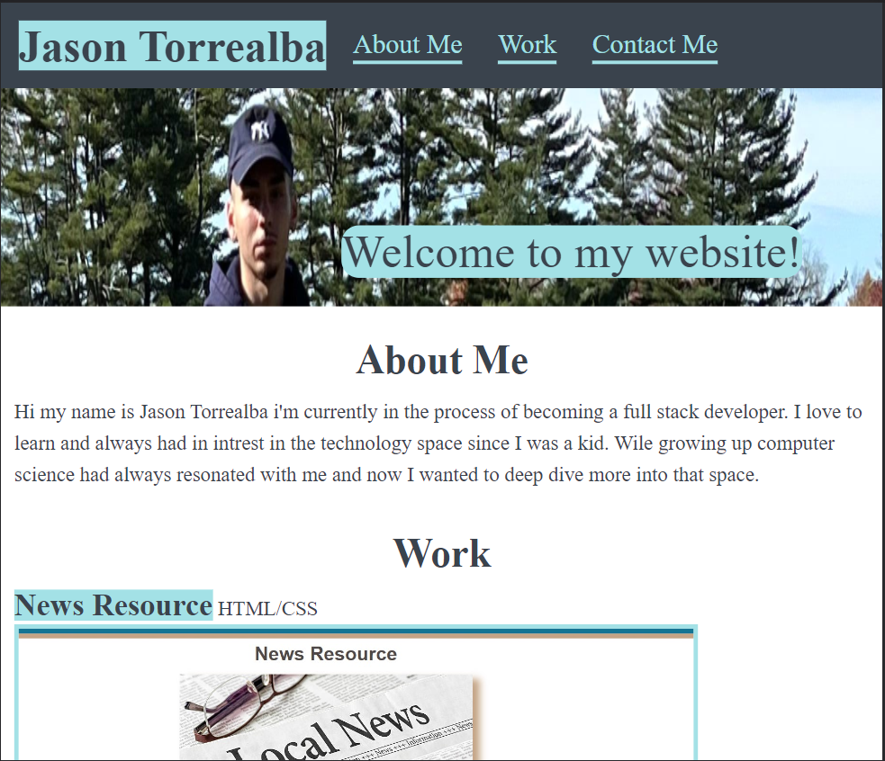

# Jasons-portfolio-module-2-challenge

## Description

I created a website from scratch only using HTML and CSS to create a portfolio. I had to make sure that the webstie was responsive so it could be viewable on all different types of screens. I achieved this by using multiple media queries and setting them to different widths to make sure each screen is able to view the website. So if somebody were to go on the website on their phone or tablet they would be able to view the website with no problems.

## Deployment

## Usage

## Code Source

I Got help from a tutor with the structure of my HTML code and CSS code. I also got help from the instructor with helping me fix my images for my website.